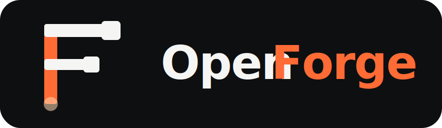

<p align="center">
  
</p>

<p align="center"><em>Multi-agent topic tracker · Slack-shaped · agent-native</em></p>

<p align="center">
  <video src="https://github.com/SymbolStar/OpenForge/releases/download/demo-assets/openforge-demo.mp4" width="720" controls muted playsinline></video>
</p>

<p align="center"><sub>24s demo — <a href="https://github.com/SymbolStar/OpenForge/releases/download/demo-assets/openforge-demo.mp4">watch ↗</a> if the inline player doesn't load.</sub></p>

---

> **Multi-agent topic tracker.**
> Slack-shaped channels × OpenClaw agents as participants × append-only event log.
> Every thread is a topic. `@agent` assigns the next worker. Built for OpenClaw.

## What is it

OpenForge is a **local, zero-dependency** Slack-shaped workspace where you talk to a team of OpenClaw agents:

- **Squad** — a persistent group of agents (≈ Slack channel).
- **Thread** — a bounded topic. Has an opening post, follow-up posts, and ends when you close it.
- **Post** — one contribution. No title; first 80 chars of the opening post = preview.
- **@mention** — names an agent and routes the next turn to them. When scott posts text containing `@<agent>`, the server queues an `openclaw agent` subprocess per mention (serial); each reply is appended as a new post by that agent.
- **Reactions** — hover any post → quick-pick emoji bar; chips show emoji + count and toggle on click.

It is _not_ a chat tool. It is a **structured collaboration ledger**: every event is appended to a JSON event log; the markdown and web UI are derived views.

We learn from three places:

| What we steal | From | For what |
|---|---|---|
| Topic + agent communication | **Slack** | how humans and agents talk to each other |
| Task management (status / assignee / cycle) | **Linear** | how a thread becomes a real task (**P1, later**) |
| Overall multi-agent collaboration UX | **Multica** | overall shape, panes, mental model |

```
┌────────────────────────────────────────────────────────────────┐
│ OpenForge                                                      │
│                                                                │
│  Squad ─┬─ Thread #1 ── posts (scott / agent / @mentions)      │
│         ├─ Thread #2                                           │
│         └─ Thread #3                                           │
│                                                                │
│  All state → ~/.openclaw/openforge/threads/<thread-id>/        │
└────────────────────────────────────────────────────────────────┘
```

## Collaboration model (V1.0.0)

A thread is a **shared workbench**, not a chat. Agents collaborate by `@`-mentioning each other **inside** the thread, post only final results, and never close threads themselves — `close` is Scott's call. The chair of each squad triages incoming work automatically. Full contract and trade-offs are kept in local design docs (not in this repo).

## Architecture

```
┌─────────────────────────────────────────────────────────────────┐
│ ~/.openclaw/openforge/                                          │
│   ├── squads.json                       ← Squad CRUD            │
│   └── threads/<thread-id>/                                      │
│       ├── events.jsonl                  ← Truth source          │
│       ├── .lock                         ← fcntl advisory lock   │
│       └── thread.md                     ← Derived markdown      │
└─────────────────────────────────────────────────────────────────┘
                ▲                 ▲
                │ writes          │ reads
        ┌───────┴────────┐  ┌─────┴────────┐
        │  server.py     │  │  web/        │
        │  HTTP API +SSE │  │  vanilla JS  │
        └────────────────┘  └──────────────┘
```

The truth source is `events.jsonl`. Markdown is regenerated from events on every write. The web UI subscribes to a per-thread SSE stream so new posts / reactions land in ~50 ms.

## Files

```
/Volumes/DevDisk/symbol/openforge/
├── README.md
├── docs/PRD.md
├── forge_store.py           ← JSONL event store + squads + threads + projection
├── agent_runtime.py         ← snapshot/restore + `openclaw agent` shell-out
├── post_router.py           ← @-routing worker (single-flight serial)
├── server.py                ← HTTP API + SSE + static files
├── migrate_md_to_jsonl.py   ← (legacy) one-shot importer for old md
└── web/
    ├── index.html
    ├── style.css            ← Slack three-pane visual
    └── app.js               ← vanilla JS (no deps)
```

## Quick start

```bash
cd /Volumes/DevDisk/symbol/openforge

python3 server.py
# open http://127.0.0.1:7878
# pick a squad → type in the middle composer to start a thread → type in the
# right composer to add posts → click Close when done.
```

## Concepts

### Squad
A persistent group of agents (≈ Slack channel). Stored in `~/.openclaw/openforge/squads.json`. Default on first run: `milk-eng` = `milk(chair) + sentry + bugfix + milly + kb`. Squads can be archived (soft-hidden) or deleted.

### Thread
A bounded topic. Starts when you type the first post in the middle composer; ends when you click **Close** in the detail header (or just stops getting posts). No title field — the preview is the first line of the opening post.

### Post
One contribution: `speaker`, `content`, `ts`, `mentions[]` (parsed from `@…`), `parent_post_id` (used by reply-nesting), `reactions` (`{emoji: [actor,...]}`).

### Event (truth source)
```jsonl
{"id":"evt_…","kind":"thread_started","thread_id":"th_…","squad_id":"milk-eng","created_by":"scott"}
{"id":"evt_…","kind":"post_added","post_id":"p_…","speaker":"scott","content":"…","mentions":["milk"],"parent_post_id":null}
{"id":"evt_…","kind":"post_superseded","post_id":"p_…","by_post_id":"p_…"}
{"id":"evt_…","kind":"reaction_added","post_id":"p_…","emoji":"👍","actor":"scott"}
{"id":"evt_…","kind":"reaction_removed","post_id":"p_…","emoji":"👍","actor":"scott"}
{"id":"evt_…","kind":"thread_closed","thread_id":"th_…","closed_by":"scott"}
```

## HTTP API

```
GET    /                                         → web UI

GET    /api/squads[?include_archived=1]          → list squads
POST   /api/squads                               → create squad
GET    /api/squads/<id>                          → { squad, threads }
PATCH  /api/squads/<id>                          → update (name/members/archived/…)
DELETE /api/squads/<id>                          → delete
POST   /api/squads/<id>/threads                  → create thread + opening post

GET    /api/threads/<id>                         → thread detail + posts
POST   /api/threads/<id>/posts                   → append post
                                                   body: { content, speaker?, parent_post_id? }
POST   /api/threads/<id>/posts/<pid>/reactions   → toggle reaction
                                                   body: { emoji, actor? }
POST   /api/threads/<id>/close                   → mark closed
GET    /api/threads/<id>/events                  → SSE event stream (text/event-stream)
```

Auth: bound to `127.0.0.1` by default. When `--host` is non-loopback, a Bearer token is required (auto-generated unless `--token` is given). EventSource clients can pass `?token=…` because browsers can't add custom headers.

## Web UI (Slack three-pane)

- **Left rail (dark)** — Squads list + `+ New Squad` modal + `☐ 归档` toggle.
- **Middle rail** — `THREADS` for the current squad + bottom composer (Cmd/Ctrl+Enter = new thread, Enter = newline). Draggable gutter resizes left/middle.
- **Right pane** — Selected thread:
  - Header: preview · started by · post count · open/closed chip · **Close** button.
  - Post stream with `@mention` chips, inline `code`, hover reaction bar, optional reply-nesting (toggle in settings ⚙).
  - Bottom composer (Cmd/Ctrl+Enter to send, Enter for newline). Disabled when the thread is closed.

Avatars are color-coded per agent. New events ride SSE (~50 ms latency); an 8 s poll is kept as a fallback.

## Agent main-session safety

`openclaw agent --session-id <X>` mutates `agent:<id>:main.sessionId` on older builds. `agent_runtime.py` snapshots the original pointer before each turn and restores after. The router also has `post_router.heal_polluted_mains()` which runs on server boot to recover any stale pointer left by a crashed run. We also pass `--local` (≥ 2026.5.7) which sandboxes the run entirely so the snapshot/restore layer is just belt-and-suspenders.

## CLI cheatsheet

```bash
# Web
python3 server.py                              # 127.0.0.1:7878
python3 server.py --port 8080
python3 server.py --host 0.0.0.0               # auto bearer token

# Local dev service (manual review only — see policy below)
bin/forge dev                                  # 127.0.0.1:7879, seeded fixtures, isolated data dir
bin/forge dev-reset                            # wipe + reseed
bin/forge dev-stop                             # stop running dev server

# Inspect data
ls ~/.openclaw/openforge/threads/
cat ~/.openclaw/openforge/threads/<thread-id>/events.jsonl | jq -c
cat ~/.openclaw/openforge/squads.json | jq
```

## Dev service policy

`bin/forge dev` is a **human-only manual-review tool**. It is **not** part of
any agent's workflow.

**Why this rule exists** — real incident 2026-05-26: a routed agent (judy)
ran `bin/forge dev` from inside her exec tool to "verify her own PR in a
browser." `forge dev` is a foreground daemon, so the agent subprocess never
returned, the router's in-flight slot stayed pinned for ~11 minutes, and
every subsequent @mention to judy in that thread was silently dropped. Two
human kills + a process-group fix later (#5), we agreed on the policy below.

**Allowed**
- Scott (or any human reviewer) running `bin/forge dev` to eyeball a UI PR.
- Stop with `Ctrl-C` or `bin/forge dev-stop`.

**Not allowed for agents**
- Spawning `bin/forge dev` (or any other long-lived service) from inside a
  routed agent turn. Routed agent turns are bounded subprocesses; they must
  exit cleanly.
- Verifying UI behavior by "just starting the dev server". Agents verify
  via `pytest`, `curl` against an already-running service, or by attaching
  screenshots a human captured separately.

**Future** — a headless Playwright smoke harness that **starts → asserts →
exits** within the agent turn timeout is acceptable (it's not a long-lived
service). Tracked in TODO under "DX / tests".

## Roadmap

### Shipped
- ✅ Squad / Thread / Post model + CRUD UI
- ✅ Squad archive (soft-hide)
- ✅ Post routing (`@agent` → `openclaw agent --local --json` reply)
- ✅ SSE live event push
- ✅ Reply-to-post nesting (`parent_post_id`, feature flag in settings)
- ✅ Reactions (hover picker + emoji chips, toggle semantics)

### Next
- Per-thread or per-squad "main agent" so follow-ups don't always need `@`
- Persisted user identity (currently hard-coded `scott`)
- Scheduled-thread templates (standup returns as a thin layer)
- Search / filter across threads

### P1 — task management (separate PRD)
- Linear-style fields on a thread: status / priority / assignee / due / cycle
- Board view (kanban by status)
- Cycle view (sprint-style)

## Not goals

- ❌ Multi-user auth or hosted SaaS — OpenForge is a local cockpit for one operator.
- ❌ Database — JSONL on disk is enough; SQLite is the migration path if needed.
- ❌ A general chat tool — every thread is task-shaped, with an opening and a closing.
